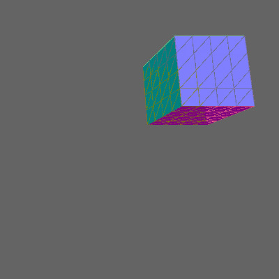
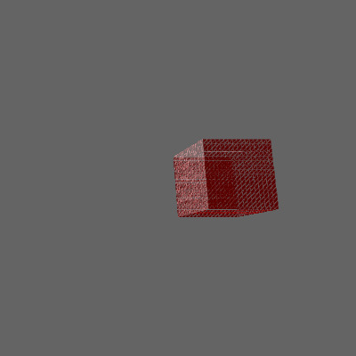

# TinyRasterizer

迷你3D光栅软渲染器。
这个是个学习+验证作品，代码组织的比较零散, 基本是数学公式的直接翻译。

坐标系比较奇怪，因为是直接输出到图片，一开始没组织好。正确做法应该是在光栅器内封装从NDC坐标系到图片坐标系，外部只需要操作坐标变换到NDC就可以了。没有做这一步，导致坐标系变得比较混乱，ortho projection和perspective projection实现的应该都有问题。

### 使用的第三方库:
- glm(数学库，没必要重复造轮子)
- assimp(导入obj需要，没必要手写parser)

### 目标：
- [x] 三角形光栅化
- [x] 变换矩阵(model,view,projection)(projection有点问题)
- [x] 深度测试
- [x] 摄像机
- [x] 模型导入
- [x] 纹理插值
- [x] HDR(Reinhard tone mapping)
- [x] MSAA(Multisample anti-aliasing)
- [x] Normal visualize
- [x] 顶点插值
- [ ] ~~shader~~
- [x] Phong光照(没有做高光)
- [ ] ~~normal mapping~~
- [ ] ~~背面剔除~~
- [ ] ~~窗口裁剪~~
- [ ] ~~shadow mapping~~

### Preview
**颜色插值**

**深度测试**

**模型加载**

**纹理插值/立方体/ortho投影**

**纹理插值/立方体/persp投影**

**Phong光照/立方体/persp投影**

**MSAA抗锯齿**

**Normal visualization**

**顶点插值**

(三角形和三角形之间有缝隙，感觉是因为projection没正确实现导致的)

### reference
[ssloy/tinyrenderer](https://github.com/ssloy/tinyrenderer/wiki)
[learnOpenGL](https://learnopengl.com/)
