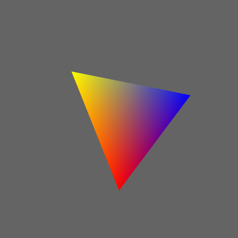
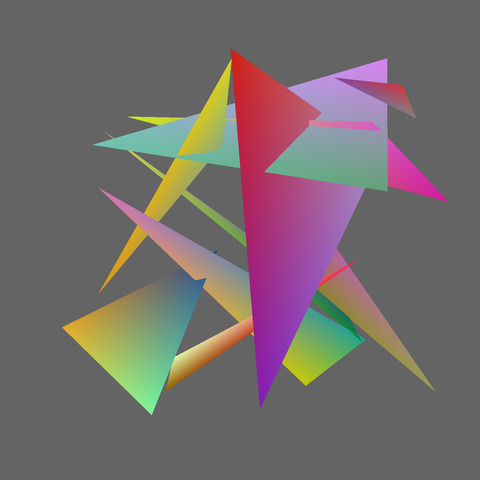
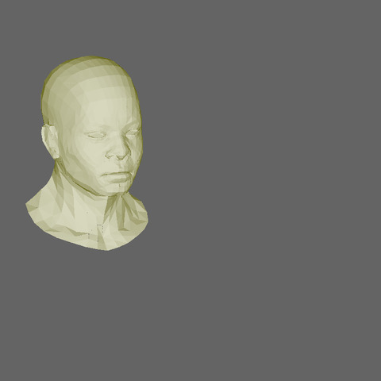
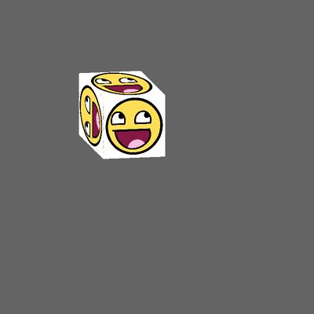
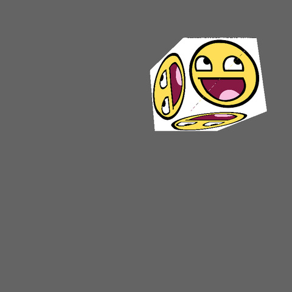
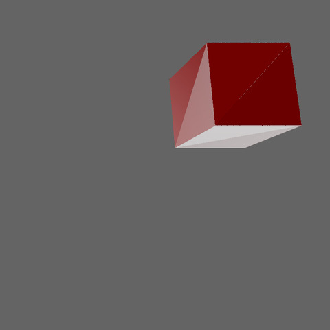
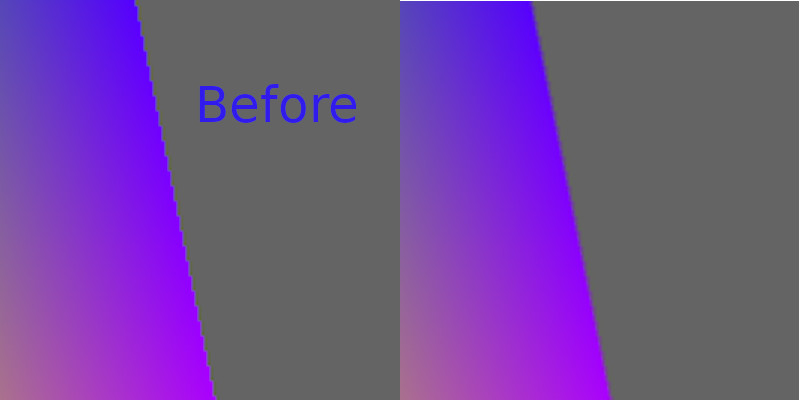

# TinyRasterizer

迷你3D光栅软渲染器，遵照OpenGL的一些惯例设计。

### 使用的第三方库:
- glm(数学库，没必要重复造轮子)
- assimp(导入obj需要，没必要手写parser)

### 目标：
- [x] 三角形光栅化
- [x] 变换矩阵(model,view,projection) 
- [x] 深度测试
- [x] 摄像机
- [x] 模型导入
- [x] 纹理插值
- [x] HDR(Reinhard tone mapping)
- [x] MSAA(Multisample anti-aliasing)
- [ ] ~~shader~~
- [x] Phongg光照(没有做三角形顶点插值，高光没有实现)
- [ ] ~~normal mapping~~(没有做三角形顶点插值,实现不了)
- [ ] ~~背面剔除~~
- [ ] ~~窗口裁剪~~
- [ ] ~~shadow mapping~~

### Preview
**颜色插值**

**深度测试**

**模型加载**

**纹理插值/立方体/ortho投影**

**纹理插值/立方体/persp投影**

**Phong光照/立方体/persp投影**

**MSAA抗锯齿**

### reference
[ssloy/tinyrenderer](https://github.com/ssloy/tinyrenderer/wiki)
[learnOpenGL](https://learnopengl.com/)
